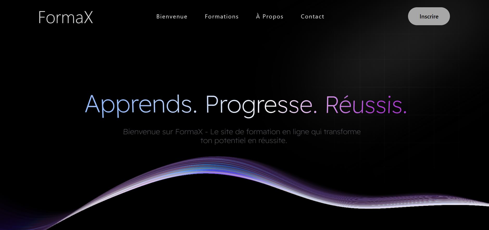
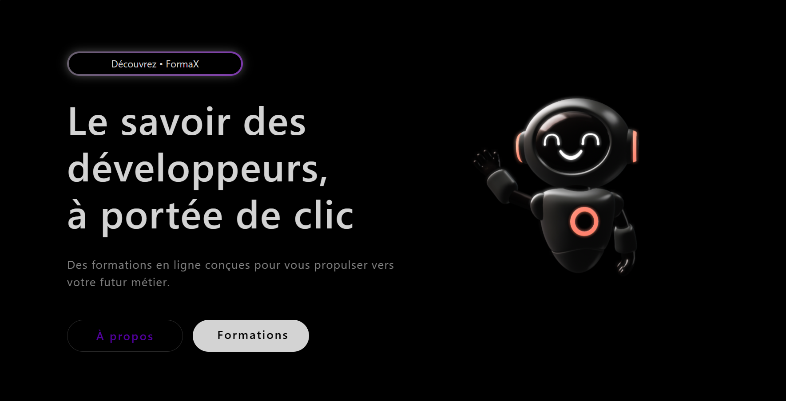
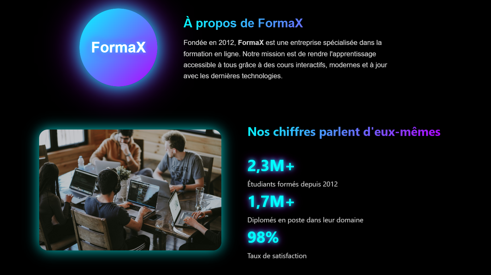

# FormaX 🎓💻

🌐 Site en ligne : [https://formax-elearning.vercel.app/](https://formax-elearning.vercel.app/)

## 📸 Captures d’écran

  
   
  <em>Page d’accueil – Vue principale</em>

 

  
   
  <em>Page d’accueil – Section inférieure</em>

 

  
   
  <em>Page À propos – Présentation du projet</em>

---

## 📌 À propos du projet

**FormaX** est le tout premier gros site web que j’ai réalisé dans le cadre de mon cours de développement web.  
Ce projet représente une étape importante dans mon apprentissage, car il m’a permis de mettre en pratique plusieurs concepts vus en classe comme la structure HTML, le design en CSS et l’organisation d’un site complet.

FormaX est une plateforme de formation en ligne qui propose différents parcours dans le domaine des technologies et du développement web.

---

## 🎯 Objectif du site

Le but de ce projet était de :

- Créer un site web structuré et professionnel
- Présenter différentes formations technologiques
- Travailler le design et l’expérience utilisateur
- Appliquer les bonnes pratiques HTML et CSS
- Organiser un projet web avec plusieurs pages liées entre elles

---

## 📚 Formations proposées

FormaX propose plusieurs formations spécialisées :

### 🧪 Testeur Logiciel
Un testeur logiciel vérifie la qualité et la fiabilité des applications avant leur mise en ligne.  
Cette formation introduit aux bases du contrôle qualité, aux tests manuels et aux tests automatisés.

---

### 🤖 Intelligence Artificielle
Le programmeur en intelligence artificielle conçoit des algorithmes capables d'apprendre et de résoudre des problèmes complexes.  
La formation couvre les bases des algorithmes intelligents et l’introduction au développement IA.

---

### 🌐 WordPress
WordPress permet de créer facilement des sites web modernes et personnalisés sans coder.  
Cette formation explique comment concevoir, personnaliser et gérer un site WordPress professionnel.

---

### ⚛ React
React permet de créer des interfaces web dynamiques et rapides avec JavaScript.  
Les étudiants apprennent à développer des composants et à créer des applications modernes.

---

### 🅰 Angular
Angular est un framework puissant pour développer des applications web complètes et dynamiques.  
La formation met l’accent sur la création d’applications structurées et évolutives.

---

## 🛠 Technologies utilisées

- HTML5
- CSS3
- JavaScript
- Font Awesome pour les icônes

---

## 🧠 Ce que j’ai appris

Grâce à ce projet, j’ai appris :

- À structurer un site multi-pages
- À organiser mon code proprement
- À améliorer le design avec CSS
- À créer des sections dynamiques et interactives
- À gérer les liens internes entre les pages
- À construire un projet web complet du début à la fin

---

## 🚀 Améliorations futures

Dans le futur, j’aimerais :

- Ajouter une base de données
- Ajouter un système d’inscription / connexion
- Ajouter plus d’interactivité avec JavaScript
- Déployer le site en ligne

---

## 👨‍💻 Auteur

Projet réalisé par **Tarik A.**  
Dans le cadre d’un cours de développement web.

---

⭐ Merci de visiter FormaX !